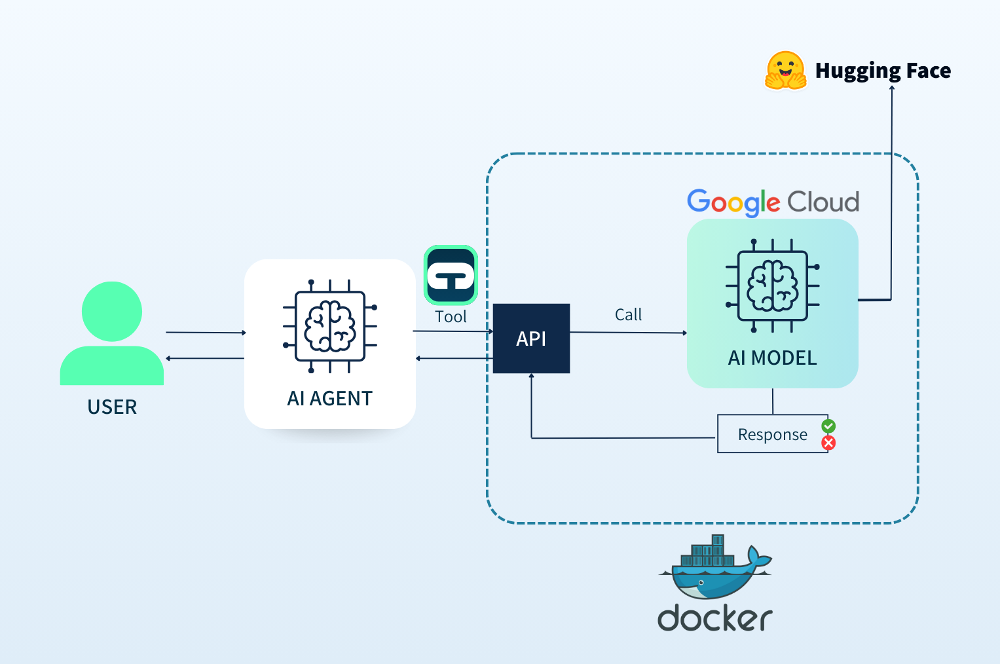
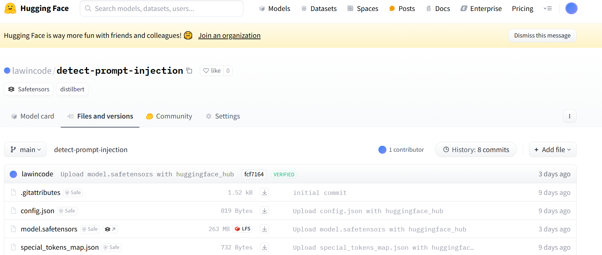
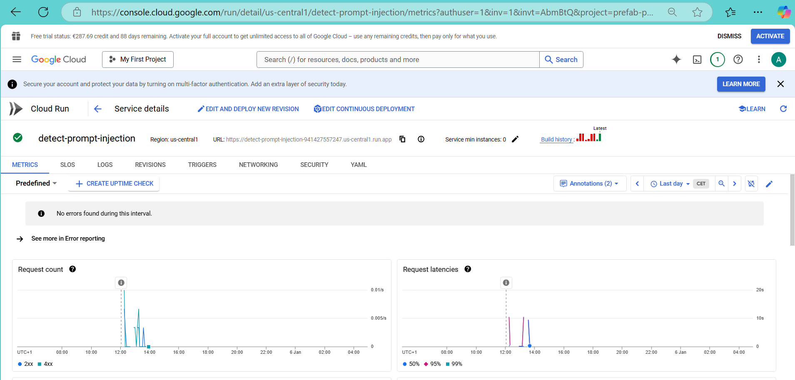
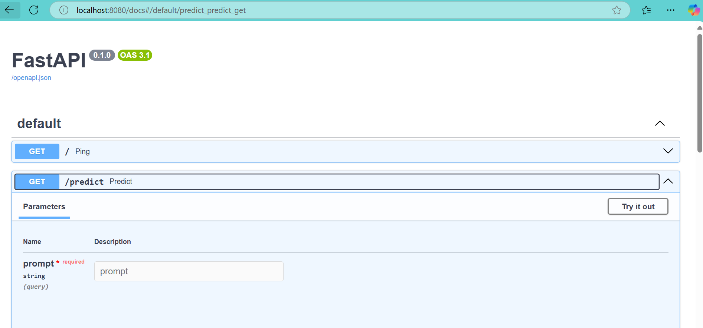

<div align="center">
<h1>Prompt injection detector</h1>
<h3>The go-to API for detecting and preventing prompt injection attacks🔍🛡️</h3>
</div>

<div align="center">
<a href="https://contrastoai.com/" target="_blank">

</a>
<p><a href="https://contrastoai.com/" target="_blank">Contrasto.AI</a></p>
</div>

<br/>

<div align="center">

   <a href="https://www.linkedin.com/company/contrastoai" target="_blank"> 
   

</a></div>


<br/>

<div align="center">

</div>

As AI becomes integral to communication and decision-making, **malicious prompt injections pose significant risks**, leading to corrupted outputs, security breaches, and ethical concerns. These vulnerabilities can **undermine trust in AI systems** and expose sensitive information.

This project empowers developers to safeguard AI systems with effective prompt injection detection. Here's how:

1. **Pre-trained Model**:  
   - We use the `madhurjindal/Jailbreak-Detector` model from Hugging Face Hub as a base transfer learning model.  
   - This model classifies **English prompts** as either benign or malicious, providing a reliable baseline for detection.

2. **Custom Datasets**:  
   - We download several datasets from Hugging Face, including a collection of 250+ prompt injection examples and real-world examples of AI system manipulation attempts.
   - Additionally, using OpenAI's GPT API, we generate one custom dataset in **Spanish**: +700 malicious prompts across different attack categories (direct injection, code injection, roleplay jailbreak, etc.)
   - All datasets undergo careful preprocessing and are split 80/20 into training and testing sets to ensure robust model evaluation.

3. **Model Training and Deployment**:  
   - We fine-tune a new model using these datasets to enhance its detection capabilities.  
   - The trained model is deployed for both local and cloud-based use with FastAPI service.

4. **User interface**:
   - The API is deployed in a cloud run instance and can be called from any streamlit app. We provide a simple streamlit app to test the API [here](https://detect-prompt-injections.streamlit.app/).

<div align="center">

</div>

By leveraging advanced algorithms and proactive monitoring, **we ensure your AI remains resilient, reliable, and secure against manipulation**.


*This projects is part of the 1st capstone of [Datatalks Machine Learning Engineering zoomcamp](https://github.com/DataTalksClub/machine-learning-zoomcamp/tree/master).*

## Table of Contents
- [Components](#components)
- [Features](#features)
- [Installation](#installation)
- [API Endpoints](#api-endpoints)


## Components
- `train.py`: Model training pipeline with dataset preparation, fine-tuning and model export.
- `predict.py`: FastAPI server implementation for real-time predictions by loading and serving the trained model.
- `utils.py`: Utility functions for model inference.
- Notebooks:
  - `01a_spanish_jailbreak_creation.ipynb` and `01b_english_jailbreak_creation.ipynb`. Download data and calls the OpenAI API to generate datasets for fine-tuning the model.
  - `02_notebook.ipynb` and `2a - EDA.ipynb`. Imports the pretrained model, prepares data, performs EDA, fine-tuning, evaluation, and hyperparameter fine-tuning. 
  - `03_upload_model_to_HF.ipynb`. Uploads the model to Hugging Face.
  - `04_calling_GCP_deployed_model.ipynb`. Calls the locally dockerized model and the API for the GCP-deployed model.

## Features
- **Detection**: Accurately detects prompt injection attacks in both English and Spanish.
- **Ease of Use**: Simple API integration for seamless adoption.
- **Fine-Tuned Models**: Utilizes pre-trained transformer models for classification, followed by additional fine-tuning. 
- **Customizable**: Supports custom training with your datasets.
  
## Installation
### 1. Prerequisites 📑✅
- Python 3.12
- [Poetry](https://python-poetry.org/)
  - For dependency management and venv.  
- [Make](https://www.gnu.org/software/make/)
  - Provides commands and shortcuts to activate the venv and run scripts described in the `Makefile`.
  - You will also need to define your Hugging Face token,`HF_TOKEN` in a `.env` file (remove the _example from the provided `.env_example` file). This token is used for uploading and loading models from Hugging Face.
  
### 2. Training Steps 🏋️‍♀🏋

#### Pre-trained transfer learning

This step involves loading the pretrained `madhurjindal/Jailbreak-Detector` model for later fine-tuning. 

#### Fine tune: data retrieval, data generation and hyperparameter tunning

Here, we focus on retrieving and generating data for training the model, followed by performing hyperparameter tuning to optimize the model’s performance. 

This process is described in `01_spanish_jailbreak_creation.ipynb` and `02_notebook.ipynb`.

#### Run the training

The above steps are performed in the `train.py` script. Execute the following command to train the model:
```
make run-train
```

The trained model (`safe_tensors`) and tokenizer are saved using the `transformers` `Trainer` export method.
 
#### Upload trained model to Hugging Face

Once training is complete, we upload the [saved model](https://huggingface.co/ana-contrasto-ai/detect-prompt-injection/tree/main) to Hugging Face for easy deployment and sharing. 

This process is described in `03_upload_model_to_HF.ipynb`.

### 3. Deployment Steps 🐳🐳
Clone the repository:

   ```bash
   gh repo clone AnaBelenBarbero/detect-prompt-injection
   cd prompt-injection-detector
   ```

#### a) Run local venv
1. Install dependencies:

    ```bash
    poetry install
    ```

2. Run FastAPI:

    ```bash
    make run-api-dev
    ```

#### b) Run local Docker container
1. Build the container:

    ```bash
    make docker-build-local
    ```

2. Run the container, mapped to `localhost:80`:

    ```bash
    make docker-run-local
    ```

#### c) GCP Cloud run deployed
The `deploy` branch of the project is synced with GCP Cloud Run via Continuous Deployment (CD), so any commit merged there will be built and deployed automatically.

Check `04_calling_GCP_deployed_model.ipynb` for authentication and request-building details.

<div align="center">

</div>

## API Endpoints

**Predict**
GET parameters: `prompt` and a `text`.

<div align="center">

</div>

Snippet to send the API GET request from Python:
```
import requests
PORT = 80
LOCAL_URL = f"http://localhost:{PORT}"

response = requests.get(
    f"{LOCAL_URL}/predict",
    params={"prompt": "What is the capital of France?"}
)
response.json()

#{'label': 'benign', 'probability': 0.9996808767318726}
```
